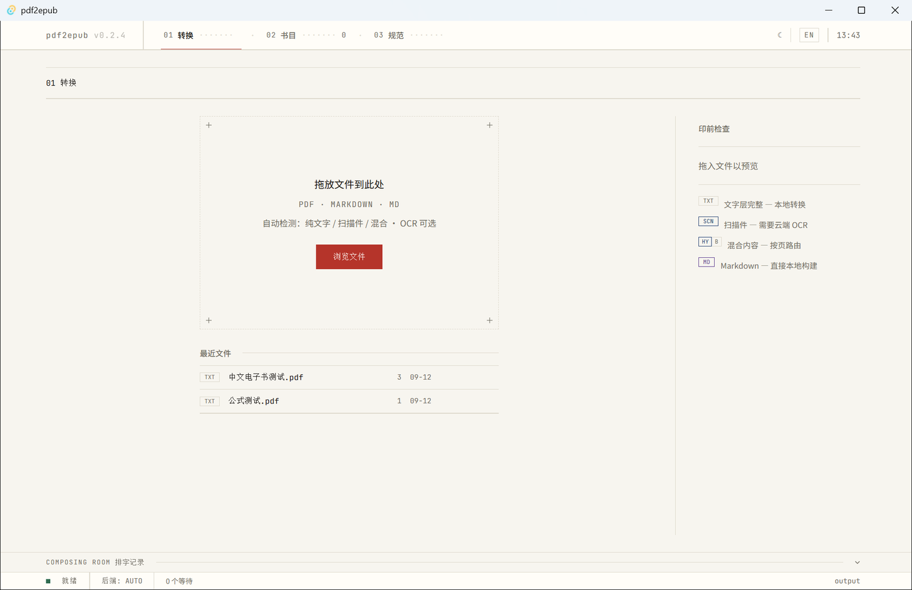
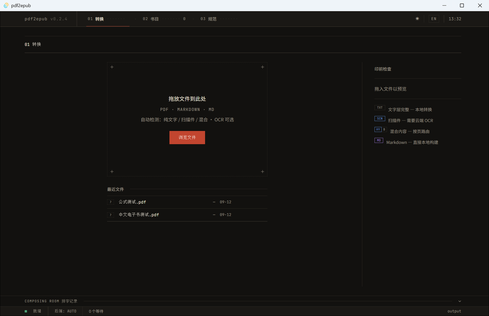
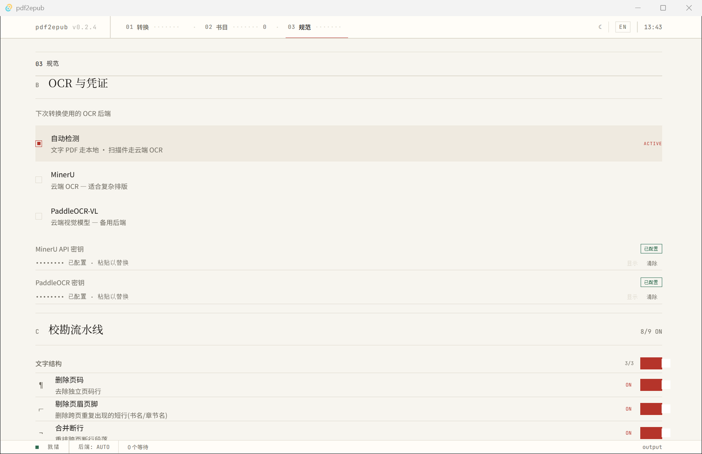

# pdf2epub

> **PDF → EPUB 电子书转换工具** · 电子版 / 扫描版 / Markdown 一键转换,自动清理,排版精致

[](https://github.com/WanderSu/pdf2epub/releases)
[](https://github.com/WanderSu/pdf2epub)
[](https://github.com/WanderSu/pdf2epub/releases)
[](LICENSE)

**中文** | [English](README.en.md)

---

## 目录

- [截图](#截图)
- [特性](#特性)
- [工作流](#工作流)
- [快速开始](#快速开始)
- [桌面端](#桌面端)
- [CLI 用法](#cli-用法)
- [配置](#配置)
- [常见问题](#常见问题)
- [已知限制](#已知限制)
- [目录结构](#目录结构)
- [开发](#开发)
- [License](#license)

---

## 截图

| 转换(浅色) | 转换(深色) |
|---|---|
|  |  |

| 规范(设置) |
|---|
|  |

界面语言:**铅字工坊**——全站只由纸、墨、朱砂三种材质构成:转换流程叫**工序**(制版 → 检字 → 校勘 → 付印),
分片叫**折帖**(「第 2 帖 · 共 3 帖」),清理项叫**校勘清单**,预检叫**印前检查**,控制台叫**排字记录**,书库叫**书目**。

---

## 特性

### 转换引擎

| 特性 | 说明 |
|---|---|
| 🔍 **自动检测** | 文字层完好 → 本地提取;纯扫描 → 云端 OCR;混合 → 页级路由 |
| 🧠 **伪文字层识别** | 提取乱码的 PDF 会提示你,由你决定是否改用 OCR(不做自动判决) |
| ☁️ **云端 OCR** | MinerU / PaddleOCR-VL 可切换;MinerU 失败自动降级为渲染纯图重试 |
| 🪧 **印前检查** | `--dry-run` 预检:转换前看到类型 / 页数 / 计划后端 / 折帖数 / 当日云端页数是否够用,不产出文件、不消耗额度 |
| 📚 **>200 页自动分片** | MinerU 单任务限 200 页/200MB;超大书自动按 page_ranges 分段提交、并行解析、按序合并 |
| ♻️ **中断续跑** | 云端 OCR 已提交的任务(batch/job id)落盘;超时、关窗口后重跑直接继续轮询,不重新上传、不重复扣配额 |
| 🧹 **校勘式清理** | 页码剔除、页眉页脚重复行剔除、跨页断行连接、OCR 空格合并、中文空格修正、重复/空标题与层级修正、强调字体标注粗体;9 项可单独开关 |
| 📇 **元数据** | 文件名符合「标题 - 作者」自动嵌入 `dc:title` / `dc:creator` |
| 📦 **批处理** | 失败重试(指数退避)、跳过已完成、断点续跑、单文件失败不中断 |
| 🎨 **精装书级排版** | 内置 `config/book.css`:中文衬线正文、首行缩进、标题体系、公式/表格/图片保护 |
| ✅ **结构校验** | 每次转换后自动校验 EPUB(图片/公式/脚注/TOC/内部链接/CSS);`--strict` 可让失败项直接判该文件失败 |

### 桌面端

| 特性 | 说明 |
|---|---|
| 🗂 **3 个工作区** | `01 转换` / `02 书目` / `03 规范`——目录式导航,不再有独立的导入页(拖放区就是转换区的空状态) |
| 🪧 **印前检查面板** | 拖入文件后立刻显示检测结果(类型 / 页数 / 折帖 / 云端页数),并把结果回写到队列行 |
| 🔧 **工序进度** | 制版 → 检字 → 校勘 → 付印,云端 OCR 时标 `OCR`,折帖进度显示「第 N 帖 · 共 M 帖」 |
| 🗒 **排字记录** | 实时 CLI 日志(时间戳 / 级别 / 内容),可折叠、可 TAIL / PAUSE |
| ⛔ **真实取消** | 取消会 `taskkill /T` 杀掉整棵 CLI 进程树——不会白跑完还继续扣云端配额 |
| 📖 **书目** | `library.json` 持久化,标题/作者取自 EPUB 元数据;类型 / 后端 / 页数随转换回写,重启不丢 |
| ⚙️ **规范页** | OCR 后端、凭证、输出目录、转换器路径、环境检查、9 项校勘开关、严格校验、主题、语言;未保存改动会提示,「放弃」能真正回滚 |
| 🌐 **双语 + 双主题** | 中/英一键切换(技术 token 两语都保持英文),亮/暗双主题 |

---

## 工作流

```text
电子版 PDF ──► PyMuPDF4LLM(本地)──┐
扫描版 PDF ──► 云端 OCR ──────────┼──► Markdown 清理 ──► Pandoc + CSS ──► EPUB
MinerU 输出 ──► full.md + images ──┤      (自动:页码/断行/空格/粗体)
已有 Markdown ────────────────────┘
```

---

## 快速开始

### 方式一:桌面端(推荐)

从 [Releases](https://github.com/WanderSu/pdf2epub/releases) 下载 `pdf2epub-v0.4.1-win-x64.zip` 并解压到任意目录,双击 `pdf2epub.exe`。

> 💡 压缩包内含转换引擎 `cli.exe`(已内置 Python 运行环境,免安装 Python);保持 `pdf2epub.exe`、`cli.exe`、`config/` 三者同级即可运行。

**首次使用两步**:

1. 安装 [Pandoc](https://pandoc.org/installing.html)(EPUB 生成引擎,必需):`winget install pandoc`
2. 在解压目录创建 `apikey.json`(云端 OCR 凭证,模板见下方「准备凭证」)——或直接在 **03 规范 → OCR 与凭证** 里粘贴密钥后点保存

**三个工作区**:`01 转换`(拖放 + 队列 + 排字记录) · `02 书目`(转换结果) · `03 规范`(设置)。

### 方式二:CLI

**依赖**:Python 3.12 · [uv](https://docs.astral.sh/uv/) · [Pandoc](https://pandoc.org/installing.html)(≥3.0,需在 PATH 中)

```bash
git clone https://github.com/WanderSu/pdf2epub.git
cd pdf2epub
uv sync    # 创建 .venv 并安装 ebook-converter 命令
```

**准备凭证**(仅扫描版 / OCR 需要)——项目根创建 `apikey.json`(已 gitignore):

```json
{
    "MinerU": "你的 MinerU Token",
    "PaddleOCR-VL": "你的 PaddleOCR Token"
}
```

也可以用环境变量 `MINERU_API_TOKEN` / `PADDLEOCR_TOKEN`(优先级更高)。

**转换**:

```bash
# 单个文件(自动检测类型)
.venv/Scripts/ebook-converter.exe "我的书.pdf" -o output

# 整目录批处理
.venv/Scripts/ebook-converter.exe books/ -o output

# 已有 Markdown(含 MinerU 桌面端输出的 full.md,按「书名.md + images/」放置)
.venv/Scripts/ebook-converter.exe "我的书.md" -o output

# 转换前先预检(不产出文件、不消耗额度)
.venv/Scripts/ebook-converter.exe "扫描书.pdf" --dry-run

# 强制指定 OCR 后端
.venv/Scripts/ebook-converter.exe "扫描书.pdf" -o output --backend mineru

# 关闭部分清理项(逗号分隔;默认全部开启,bold 默认关)
.venv/Scripts/ebook-converter.exe "我的书.pdf" -o output --clean-disable join_lines,cjk_spaces
```

**输出**:每本书生成 `output/<书名>.epub`;中间产物在 `work/<书名>/book.md + images/`(可手工修订后重新生成)。

> ⚠️ 检测到疑似**伪文字层**时,单文件转换会交互询问是否改用 OCR;批处理模式不打断,仅在日志中警告。

---

## 桌面端

基于 **Tauri 2 + React 19 + Tailwind v4**,UI 源自 Figma 设计稿(铅字工坊主题:纸 / 墨 / 朱砂)。

### 从源码构建

```bash
cd desktop
npm install
npm run tauri dev                    # 开发模式(vite 热更新)
npm run tauri build -- --no-bundle   # 构建 release exe(产物 desktop.exe)
```

前置要求:Node.js ≥ 20 · Rust(`stable-x86_64-pc-windows-msvc`)· Visual Studio Build Tools(C++ workload)

### 界面状态从哪来(引擎事件流)

桌面端**不再从中文日志里猜状态**。转换时壳会给 CLI 加 `--json-events`,stdout 只走
JSON 事件(`hello/detect/plan/stage/progress/shards/verify/warning/error/complete`),
人类可读日志走 stderr 进「排字记录」。进度百分比按事件里的**阶段权重 + 区段/分片进度**
计算 —— 不是「日志行数 × 5%」。事件表与权重在 `src/events.py`(权威),前端消费逻辑在
`desktop/src/events.ts`。

未开事件流的老版 CLI 仍能用:前端会退回旧正则解析,并在排字记录里给该行标 **LEGACY** 徽标。

不开窗口也能验证解析(桌面端没有测试框架,这条是唯一的自动化验证):

```bash
cd desktop
npm run verify:events                            # 内置 hybrid / MinerU / legacy 三类事件流
uv run ebook-converter samples/pdfs/中文电子书测试.pdf --json-events > /tmp/ev.jsonl   # 真实捕获
npm run verify:events -- /tmp/ev.jsonl
```

一键打包发布(版本守卫:四处版本号必须一致):

```bash
uv run python scripts/build_release.py 0.3.0            # 构建引擎 + 壳 + 打包 + 自检
uv run python scripts/build_release.py 0.3.0 --skip-build --no-check   # 只复用现有产物重新打包
```

---

## CLI 用法

```
ebook-converter <文件或目录>... [-o 输出目录] [选项]
```

| 选项 | 说明 |
|---|---|
| `--backend {auto,pymupdf,mineru,paddleocr}` | 强制指定后端(默认 `auto` 自动检测) |
| `-o, --output DIR` | EPUB 输出目录(默认 `output/`) |
| `--retries N` | 单文件失败重试次数,指数退避(默认 2) |
| `--force` | 忽略「已完成」状态,强制重新转换 |
| `--clean-disable LIST` | 关闭指定清理项(逗号分隔):`page_numbers,running_heads,join_lines,ocr_spaces,cjk_spaces,dup_headings,headings,bold,images` |
| `--strict` | EPUB 生成后做结构校验,有失败项即判该文件失败(默认只告警) |
| `--dry-run` | 预检:只输出类型/页数/计划后端/折帖数与当日 OCR 额度,不产出任何文件 |
| `--dry-run --json` | 同上,但输出 JSON(桌面端「印前检查」用的就是这个) |
| `--json-events` | 阶段事件以 **JSON Lines** 写到 stdout(人类日志改走 stderr):桌面端据此显示真实进度与状态;与 `--dry-run` 同用时忽略(预检自带 JSON) |
| `--no-resume` | 不复用云端已提交的 OCR 任务(默认中断后续跑,不重新上传) |
| `--no-log` | 不写日志文件 |
| `--verbose` | 控制台输出 DEBUG 日志 |

---

## 配置

`config/config.yaml`:

```yaml
ocr_backend: mineru          # 默认 OCR 后端:mineru / paddleocr
mineru:
  max_pages_per_task: 200    # MinerU 单任务页数上限;超过自动分片提交(page_ranges)
  resume: true               # 中断后复用已提交的云端任务(续跑)
clean:                       # 清理项开关(桌面端「校勘流水线」/ CLI --clean-disable 同源)
  page_numbers: true         # 剔除独立页码行
  running_heads: true        # 剔除页眉页脚重复行(跨页反复出现的短行)
  join_lines: true           # 跨页断行连接
  ocr_spaces: true           # OCR 异常空格合并(中文行内被拆开的拉丁词)
  cjk_spaces: true           # 中文排版空格修正
  dup_headings: true         # 相邻同名标题去重
  headings: true             # 空标题删除 + 标题层级跳跃修正
  bold: false                # 强调字体 → ** 粗体
  images: true               # 图片引用存在性校验
pymupdf:
  write_images: true
  bold_fonts: [...]          # 强调字体列表(楷体/中宋等),其文字标注为 **粗体**
```

`config/book.css` — EPUB 全局样式(精装书级中文排版:衬线正文、首行缩进、标题体系、公式/表格/图片保护),可按需修改。

---

## 常见问题

<details>
<summary><b>密钥保存到哪个文件?</b></summary>

保存到**壳 exe 所在目录**的 `apikey.json`。所以「便携版解压目录里的 exe」和「项目根开发形态的 exe」用的是两份不同的凭证文件——换 exe 启动时看起来像"密钥丢了",其实是读了另一个文件。桌面端 **03 规范** 页可以直接粘贴保存,也可手写该文件。
</details>

<details>
<summary><b>扫描 PDF 转换很慢 / 耗 Token?</b></summary>

OCR 是云端按页计费服务。桌面端拖入文件后**印前检查会先告诉你这本书需要多少云端页数、是否超出当日额度**,确认值得再跑;`--retries 0` 可避免失败重试浪费配额。
</details>

<details>
<summary><b>检测说「文字层损坏」但我想要本地提取?</b></summary>

交互询问时选 `[3] 继续本地提取`,或直接 `--backend pymupdf`;桌面端在排字记录上方的伪文字层提示里选 **CONTINUE LOCAL**。注意结果可能不可读。
</details>

<details>
<summary><b>MinerU 解析失败(parsing failed)?</b></summary>

工具会自动降级为「渲染纯图后重试」,一般可解决;仍失败可换 `--backend paddleocr` 或检查文件。
</details>

<details>
<summary><b>超过 200 页的书能转吗?</b></summary>

可以。MinerU 单任务限 200 页,工具自动按 200 页分段(page_ranges)并行解析后按序合并,日志会显示「自动分片 N 段」,界面显示为折帖数。注意云端每日有 1000 页优先额度,预检会提前警告。
</details>

<details>
<summary><b>转换结果有乱码 / 页码 / 断行问题?</b></summary>

`src/markdown/cleaner.py` 负责清理,9 项可单独关闭:桌面端 **03 规范 → 校勘流水线**,或 CLI `--clean-disable join_lines`。若你的书出现误删/误拼,先关掉对应那一项再看。

引用的诗会被**保留分行**:连续短行且都没有句末标点时不当成断行拼接,并在行尾补 Markdown 硬换行,让诗在阅读器里真的分行显示(与散文断行拼接同属 `join_lines` 开关)。
</details>

<details>
<summary><b>OCR 跑到一半超时 / 关了窗口,配额白扣?</b></summary>

不会。任务提交后 batch/job id 会落盘(`work/<书名>/.ocr_task.json`),重跑同一文件时直接继续轮询原任务,不重新上传、不重复扣配额;日志会显示「发现未取回的云端任务」。要强制重新提交用 `--no-resume`。
</details>

<details>
<summary><b>怎么确认图片 / 公式真的进 EPUB 了?</b></summary>

每次转换都会自动做一次结构校验(包结构、图片引用、MathML、脚注、TOC、内部链接、CSS),日志里打出 `[verify] N 失败 N 警告`。默认只告警;**要让「有失败项」直接算转换失败**,桌面端打开 **03 规范 → 质量与外观 → 严格校验 EPUB**(默认关闭),或 CLI 加 `--strict`。也可单独复核:`uv run python scripts/verify_epub.py output/某书.epub --expect-images 2`。
</details>

<details>
<summary><b>书名 / 作者不对?</b></summary>

文件名命名为「标题 - 作者」格式(如 `三体 - 刘慈欣.pdf`),元数据自动正确;否则 EPUB 标题取文件名。书目页显示的标题/作者取自 EPUB 元数据本身。
</details>

<details>
<summary><b>界面上的进度百分比是真实的吗?</b></summary>

**部分是。** CLI 没有百分比事件,百分比是按日志行推进估算的(封顶 95%),完成时置 100;分片转换用折帖数映射,相对准确。工序节点(制版/检字/校勘/付印)与折帖进度**都是真实状态**。
</details>

---

## 已知限制

- PyMuPDF4LLM 提取行间公式为**图片**(非 LaTeX);云端 OCR 的 LaTeX 公式可正常转为 MathML
  —— 实测:本地路径的公式书产出 0 个 MathML、公式以图片形式嵌入;云端路径的 20 万字书产出 135 个 MathML、与源 Markdown 数量一致
- **本地路径的公式编号可能被切成独立小图**:矢量公式区域由 PyMuPDF4LLM 的
  `cluster_drawings` 聚簇渲染,而编号 `(1)` 的括号常是独立的矢量路径、离公式本体有一大段
  水平空隙 —— 于是编号单独成图(公式本身与编号都不丢,只是分成了两张图)。
  这是上游聚簇行为,拿不到它的容差参数;公式多的书建议直接走云端后端(LaTeX → MathML,编号正常)
- 云端路径的公式编号 `\tag{n}` 已归一化为可见的 `(n)`(MathML 没有 `\tag`,不处理的话编号会**整个消失**)
- 双栏 PDF 偶发同行合并(边缘情况)
- 页码剔除 / 断行拼接为启发式规则,极端排版可能有误伤;拼接带长度门槛(相邻行 ≥6 字、跨空行 ≥10 字),**真正被断开的短行会漏拼**(代价是多一个换行,刻意选的保守方向)
- 诗行保护同样按启发式判定(连续短行 + 无句末标点):**现代诗的长行(>18 字)仍可能被拼进相邻段落**,空行分隔的单行诗也不会加硬换行;整条拼接可 `--clean-disable join_lines` 关闭
- MinerU 分片后,跨段边界的表格 / 段落可能被截断(清理规则可部分弥补)
- EPUBCheck 未安装,未做 EPUB 标准合规验证
- 界面进度按**引擎事件流**计算(阶段权重 + 区段/分片进度);封面已实现(PDF 首页渲染),但**桌面端书库缩略图仍为几何色块占位**(下一版接)
- `dc:language` 按 Unicode 脚本自动检测(zh-CN / en / ja / ko),不区分繁简;检测不出时回退 zh-CN
- 内容完整性校验只做**数量级对照**(图片 / 公式 / 正文字符 / 标题),同一句话被改写、段落顺序变化它发现不了
- hybrid 文本 / 扫描交错的书按真实页码合并;扫描区段数超过 `hybrid.max_ocr_runs`(默认 8)时合并区段,被合并区段内的局部页序可能与原文不一致(会打印警告)
- 队列不跨重启保留(最近文件列表会保留);v0.3.0 之前的旧书库记录没有类型/后端/页数,重新转换一次即可补上

---

## 目录结构

```text
src/
  backends/         # 后端:base(抽象) / pymupdf / mineru / paddleocr
  detector/         # PDF 类型自动检测(含伪文字层识别)
  markdown/         # cleaner(清理) / bold(粗体标注)
  epub/             # pandoc 封装 + EPUB 结构校验(verify)
  dryrun.py         # 印前检查(--dry-run / --dry-run --json)
  events.py         # 阶段事件流(--json-events:JSON Lines,桌面端状态/进度的唯一来源)
  batch.py          # 批处理(重试/跳过/断点续跑)
  cli.py            # ebook-converter 命令入口
  convert.py        # 自动路由(text/scanned/hybrid)
  paths.py          # 路径与凭证(apikey.json)读取
config/             # config.yaml + book.css
desktop/            # Tauri 2 桌面端(React 19 + Tailwind v4)
  src/App.tsx       # 全部界面(三工作区 + 组件族)
  src/events.ts     # 事件流解析/归约(纯函数,node 可测)
  scripts/verify-events.mjs  # 不开窗口验证事件解析(npm run verify:events)
  src-tauri/src/lib.rs  # IPC:convert_file / preflight / cancel_convert / library / env / apikey
docs/               # 界面截图
scripts/            # 测试样本生成 / 端到端测试 / EPUB 验证 / 版本与打包
tests/              # pytest(detector / cleaner / dryrun / epub verify / paths / 版本同步)
```

---

## 开发

```bash
uv run pytest -q                       # Python 测试
cd desktop/src-tauri && cargo test     # Rust 测试(IPC / 书库 / 凭证合并)
cd desktop && npm run build            # 前端类型检查 + 构建
```

设计与取舍见 [IDEA.md](IDEA.md)（架构、类型判定、后端、清理与校验原则）。

---

## License

[MIT](LICENSE) © 2026 WanderSu

> ⚠️ 本仓库不含任何书籍内容,仅代码与自生成测试样本。转换受版权保护的书籍仅供个人使用,请勿分发转换产物。
