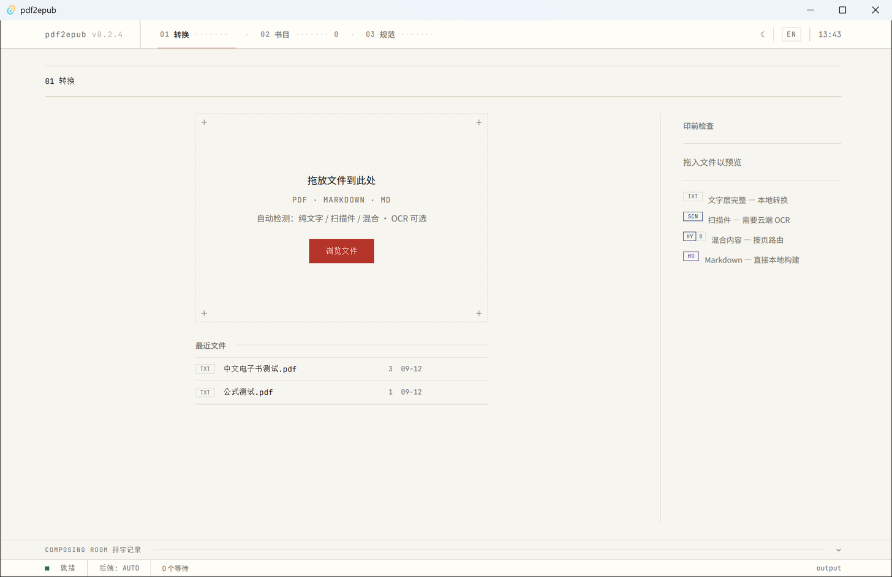
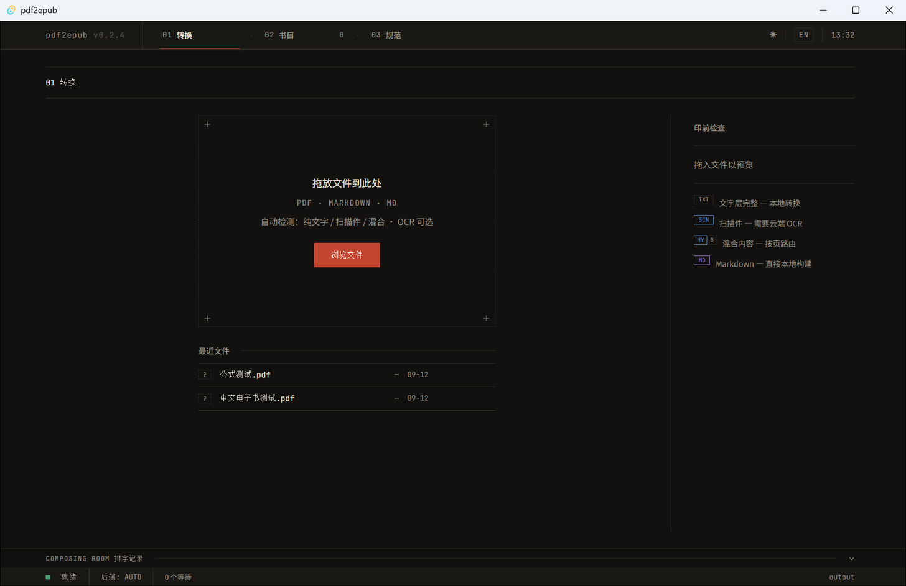
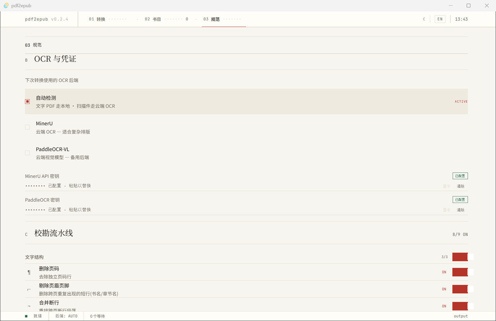

# pdf2epub

一个用于将 PDF 和 Markdown 转换为 EPUB 电子书的工具。

支持电子版 PDF、扫描版 PDF、混合 PDF，以及已有的 Markdown 文件。  
可以自动提取文字、调用 OCR、整理 Markdown，并生成适合阅读器使用的 EPUB。

[](https://github.com/WanderSu/pdf2epub/releases)
[](https://github.com/WanderSu/pdf2epub)
[](https://github.com/WanderSu/pdf2epub/releases)
[](LICENSE)

**中文** | [English](README.en.md)

---

## 目录

- [这是什么？](#这是什么)
- [效果](#效果)
- [主要功能](#主要功能)
- [安装](#安装)
- [使用桌面版](#使用桌面版)
- [命令行](#命令行)
- [OCR 配置](#ocr-配置)
- [输出文件](#输出文件)
- [EPUB 样式](#epub-样式)
- [常见问题](#常见问题)
- [CLI 参数](#cli-参数)
- [已知限制](#已知限制)
- [从源码运行](#从源码运行)
- [反馈问题](#反馈问题)

---

## 这是什么？

pdf2epub 是一个面向电子书阅读的 PDF → EPUB 转换工具。

它主要解决这样的问题：

> 手里有一本 PDF，但更希望在 Kindle、KOReader、Apple Books、Calibre 等阅读器中以 EPUB 的形式阅读。

不同类型的 PDF 会采用不同的处理方式：

- **电子版 PDF**：直接从 PDF 提取文字和图片。
- **扫描版 PDF**：使用 OCR 识别文字、图片和公式。
- **混合 PDF**：根据页面情况分别处理文字页和扫描页。
- **Markdown**：可以直接转换为 EPUB，也可以使用 OCR 产生的 Markdown 继续加工。

转换过程中还会处理常见的 PDF/OCR 问题，例如页码、页眉页脚、断行、中文空格和标题层级等。

---

## 效果

### 转换界面

| 浅色模式 | 深色模式 |
| --- | --- |
|  |  |

### 设置



桌面端采用「铅字工坊」的界面设计，将转换过程分成几个比较直观的步骤：

- **转换**：添加文件并开始转换
- **书目**：查看已经转换的电子书
- **规范**：设置 OCR、清理、输出和 EPUB 检查等选项

---

## 主要功能

### PDF 自动识别

工具会自动判断 PDF 的类型，并选择合适的处理方式：

- 有正常文字层的 PDF → 本地提取
- 扫描 PDF → OCR
- 文字和扫描页面混合 → 按页面分别处理
- 疑似存在损坏或无效文字层 → 提示用户选择处理方式

不需要每次手动判断一本 PDF 应该使用什么方法。

### OCR

目前支持：

- [MinerU](https://mineru.net/)
- PaddleOCR-VL

OCR 使用云端服务，因此扫描版 PDF 需要相应的 API Token（获取方式见 [OCR 配置](#ocr-配置)）。
使用云端 OCR 时，PDF 的页面图片会发送到所选的 OCR 服务。

对于超过单次任务页数限制的书籍，工具会自动分段处理，并按照原来的顺序合并。

### 中断后继续

OCR 任务提交后会保存任务信息。

如果转换过程中：

- 网络中断
- OCR 超时
- 关闭程序
- EPUB 生成失败

重新运行时可以继续使用已经提交的 OCR 任务，而不必重新上传整本书。

已经完成的分段结果也会保存下来。

### Markdown 清理

OCR 或 PDF 提取出来的 Markdown 往往不能直接拿来阅读，因此转换过程中会进行一些整理：

- 删除独立页码
- 删除重复页眉页脚
- 合并跨页断行
- 修正 OCR 产生的异常空格
- 修正中文排版空格
- 删除重复标题
- 修正标题层级
- 可选的粗体识别
- 检查图片引用

这些规则可以分别关闭，以便处理特殊排版的书籍。

### EPUB

最终输出为 EPUB 文件，并包含：

- 目录
- 标题层级
- 图片
- 表格
- 公式
- 脚注
- 代码块
- 内部链接
- EPUB CSS

同时会对生成的 EPUB 进行基本结构检查。

### 批量转换

可以一次转换多个文件或整个目录。

单个文件转换失败不会影响其他文件，并支持：

- 自动重试
- 跳过已经完成的文件
- 中断后继续
- 检查已有输出文件是否完整

---

## 安装

### Windows 桌面版

如果只是想使用 pdf2epub，推荐直接使用桌面版。目前桌面版只提供 Windows 版本，其他系统可以[从源码运行](#从源码运行)。

前往：

[GitHub Releases](https://github.com/WanderSu/pdf2epub/releases)

下载最新的 Windows 压缩包，例如：

```text
pdf2epub-v0.4.2-win-x64.zip
```

文件名中的版本号会随版本更新。解压后运行：

```text
pdf2epub.exe
```

桌面版已经包含转换所需的 Python 运行环境，不需要另外安装 Python。

注意保持 `pdf2epub.exe`、`cli.exe` 和 `config/` 在同一个文件夹里，不要把 exe 单独挪出去。

### 还需要安装 Pandoc

EPUB 生成使用 Pandoc，因此需要安装 Pandoc。

Windows 可以直接使用：

```powershell
winget install pandoc
```

也可以从 Pandoc 官网下载安装：

[https://pandoc.org/installing.html](https://pandoc.org/installing.html)

安装完成后需要重新打开 pdf2epub（或者重新开一个终端窗口），Pandoc 才会被程序找到。

### 第一次使用

如果转换的是普通电子版 PDF，只需要安装 Pandoc 即可。

如果需要转换扫描版 PDF，还需要配置 OCR 服务。

可以在桌面端：

```text
03 规范 → OCR 与凭证
```

中填写对应的 Token。

也可以在程序目录创建：

```text
apikey.json
```

例如：

```json
{
    "MinerU": "你的 MinerU Token",
    "PaddleOCR-VL": "你的 PaddleOCR Token"
}
```

`apikey.json` 不会被提交到 Git。

---

## 使用桌面版

打开 `pdf2epub.exe` 后，将 PDF 或 Markdown 文件拖入转换区域即可。

基本流程：

```text
添加文件
   ↓
检测 PDF 类型
   ↓
选择处理方式
   ↓
提取文字 / OCR
   ↓
整理 Markdown
   ↓
生成 EPUB
   ↓
检查 EPUB
```

转换完成后，EPUB 会出现在设置的输出目录中。

---

## 命令行

如果需要批量处理，或者希望把 pdf2epub 集成到自己的工作流中，可以使用 CLI。

### 安装

需要：

* Python 3.12
* [uv](https://docs.astral.sh/uv/)
* [Pandoc](https://pandoc.org/installing.html) 3.0 或更高版本

```bash
git clone https://github.com/WanderSu/pdf2epub.git
cd pdf2epub
uv sync
```

安装完成后可以使用：

```text
.venv/Scripts/ebook-converter.exe
```

### 转换 PDF

```bash
.venv/Scripts/ebook-converter.exe "我的书.pdf" -o output
```

程序会自动判断 PDF 类型。

### 批量转换

```bash
.venv/Scripts/ebook-converter.exe books/ -o output
```

### 转换 Markdown

```bash
.venv/Scripts/ebook-converter.exe "我的书.md" -o output
```

Markdown 里引用的图片放在同目录的 `images/` 文件夹中：

```text
我的书.md
images/
```

如果使用 MinerU 等工具提前生成了 Markdown，把输出的 `full.md` 改名为 `书名.md`（图片文件夹保持 `images/`）就可以直接转换。EPUB 的标题取自文件名，所以文件名要改成想要的书名。

### 转换前检查

如果只是想先看看 PDF 会采用什么处理方式，可以使用：

```bash
.venv/Scripts/ebook-converter.exe "我的书.pdf" --dry-run
```

它不会生成 EPUB，也不会提交 OCR 任务。

可以查看：

* PDF 类型
* 页数
* 计划使用的后端
* OCR 分段情况
* 云端 OCR 页数需求

### 指定 OCR 后端

例如使用 MinerU：

```bash
.venv/Scripts/ebook-converter.exe "扫描书.pdf" -o output --backend mineru
```

也可以使用 `--backend paddleocr` 或 `--backend pymupdf`。

默认情况下使用 `--backend auto`，由程序自动判断。

---

## OCR 配置

只有扫描版 PDF 需要 OCR。

### 获取 Token

- **MinerU**：在 [mineru.net](https://mineru.net/) 注册登录后，在控制台创建 API Token。免费额度按天计算，一般的书基本用不完。
- **PaddleOCR-VL**：Token 来自百度 [AI Studio](https://aistudio.baidu.com/)，在该服务页面开通后获取。

两个 Token 只需要填你实际要用的那一个。

### 填写凭证

在项目根目录（桌面版是程序所在目录）创建：

```text
apikey.json
```

内容：

```json
{
    "MinerU": "你的 MinerU Token",
    "PaddleOCR-VL": "你的 PaddleOCR Token"
}
```

也可以使用环境变量：

```text
MINERU_API_TOKEN
PADDLEOCR_TOKEN
```

环境变量优先级高于 `apikey.json`。桌面端也可以直接在「03 规范 → OCR 与凭证」里填写并保存。

### OCR 配额

OCR 是云端服务，通常按照页面消耗额度。

在开始正式转换之前，可以先运行：

```bash
.venv/Scripts/ebook-converter.exe "扫描书.pdf" --dry-run
```

桌面端也会在开始转换前显示预计需要处理的 OCR 页面数量。

预检默认按每天 1000 页的额度判断，超出时会给出提示。

如果不希望失败后自动重试，可以使用 `--retries 0`。

---

## 输出文件

默认情况下，每本书会生成：

```text
output/
└── 书名.epub
```

输出的 EPUB 与源文件同名，只是把扩展名换成 `.epub`。

转换过程中产生的中间文件保存在：

```text
work/
└── 书名/
    ├── book.md
    └── images/
```

如果需要手动修改转换结果，可以直接编辑 `book.md`，然后再次生成 EPUB。

这对于处理特殊排版的书籍比较方便。

---

## EPUB 样式

默认样式位于：

```text
config/book.css
```

它主要负责：

* 中文正文排版
* 首行缩进
* 标题样式
* 图片
* 表格
* 公式
* 代码块
* 脚注

样式不会强制指定阅读器的文字颜色和背景颜色，因此一般可以配合阅读器的深色模式使用。

字体和字号也可以由阅读器覆盖。

如果你有自己的阅读习惯，可以直接修改 `book.css`。

---

## 常见问题

<details>
<summary><b>扫描 PDF 为什么需要 API Token？</b></summary>

扫描 PDF 通常只有页面图片，没有可以直接提取的文字，因此需要 OCR。

目前 pdf2epub 使用 MinerU 或 PaddleOCR-VL 进行云端 OCR。

普通电子版 PDF 使用本地提取时不需要 OCR Token。

</details>

<details>
<summary><b>提示找不到 Pandoc 怎么办？</b></summary>

Pandoc 是生成 EPUB 的必需组件。

先确认已经安装（`winget install pandoc`），然后重新打开 pdf2epub，或者重新开一个终端窗口——刚安装的程序不会自动进入已经在运行的程序的运行环境。

桌面端可以在「03 规范 → 环境检查」里确认是否检测到 Pandoc。

检测不到 Pandoc 时，程序会在提取和 OCR 之前就停下来，不会白白消耗 OCR 额度。

</details>

<details>
<summary><b>超过 200 页的书可以转换吗？</b></summary>

可以。

当 OCR 后端存在单次任务页数限制时（MinerU 单任务上限为 200 页），pdf2epub 会自动将 PDF 分成多个部分处理，再按照原顺序合并。

因此不需要手动把一本大书拆成多个 PDF。

</details>

<details>
<summary><b>OCR 跑到一半关闭程序怎么办？</b></summary>

重新运行同一本书即可。

已经提交到云端的 OCR 任务会保存到：

```text
work/书名/.ocr_task.json
```

程序会尝试继续处理之前的任务，而不是重新上传整本书。

已经完成的分段结果也会保存。

</details>

<details>
<summary><b>为什么 PDF 里的文字看起来正常，转换后却出现乱码？</b></summary>

部分 PDF 虽然存在文字层，但文字层本身可能已经损坏，或者只是为了搜索而加入的伪文字层。

pdf2epub 会尝试检测这种情况。

如果确认文字层不可用，可以改用 OCR。

也可以强制使用本地提取（`--backend pymupdf`），但这种情况下结果可能仍然不可读。

</details>

<details>
<summary><b>转换后的文字出现很多断行怎么办？</b></summary>

pdf2epub 默认会尝试合并跨页断行。

如果某本书的排版比较特殊，可以在桌面端的设置中关闭对应清理规则，也可以使用 `--clean-disable join_lines`。

诗歌等需要保留分行结构的内容，目前采用启发式规则进行判断，因此特殊排版仍可能需要手动检查。

</details>

<details>
<summary><b>可以保留图片和公式吗？</b></summary>

可以。图片会进入 EPUB。

公式的处理方式取决于转换后端：

* 本地 PDF 提取：部分公式会作为图片保存
* OCR 后端：支持识别 LaTeX，并转换为 EPUB 中的 MathML

如果一本书包含大量数学公式，通常更适合使用支持公式识别的 OCR 后端。

</details>

<details>
<summary><b>转换后的书名和作者不正确怎么办？</b></summary>

如果文件名采用：

```text
书名 - 作者.pdf
```

这种格式（短横线两侧要有空格），程序会自动将其作为 EPUB 的标题和作者。

例如：

```text
三体 - 刘慈欣.pdf
```

会生成：

```text
标题：三体
作者：刘慈欣
```

如果文件名不符合这种格式，则默认使用文件名作为标题。

</details>

<details>
<summary><b>如何重新转换已经转换过的书？</b></summary>

使用 `--force`：

```bash
.venv/Scripts/ebook-converter.exe "我的书.pdf" -o output --force
```

默认情况下，程序会尽量跳过已经完成的文件。

</details>

<details>
<summary><b>如何检查 EPUB 是否完整？</b></summary>

每次转换都会进行基本的 EPUB 检查，包括：

* EPUB 容器
* manifest
* spine
* XHTML
* 目录
* 封面
* 内部链接
* CSS
* 图片引用

如果希望检查失败时直接让转换失败，可以使用 `--strict`：

```bash
.venv/Scripts/ebook-converter.exe "我的书.pdf" -o output --strict
```

</details>

---

## CLI 参数

完整命令格式：

```text
ebook-converter <文件或目录>... [-o 输出目录] [选项]
```

| 参数 | 说明 |
| --- | --- |
| `--backend {auto,pymupdf,mineru,paddleocr}` | 指定处理后端，默认 `auto` 自动检测 |
| `-o, --output DIR` | EPUB 输出目录，默认 `output/` |
| `--work DIR` | 中间文件目录，默认 `work/` |
| `--retries N` | 单个文件失败后的重试次数，默认 2 |
| `--force` | 忽略「已完成」，强制重新转换 |
| `--clean-disable LIST` | 关闭指定的 Markdown 清理规则（逗号分隔，可重复） |
| `--strict` | EPUB 检查出现失败项时让转换失败，默认只警告 |
| `--lang LANG` | 指定 EPUB 语言（如 `zh-CN`、`en`、`ja`），默认按正文自动判断 |
| `--dry-run` | 只进行转换前检查，不生成文件 |
| `--json` | 配合 `--dry-run`，以 JSON 输出预检结果 |
| `--json-events` | 以 JSON Lines 输出阶段事件，供桌面端使用 |
| `--no-resume` | 不继续之前提交的 OCR 任务 |
| `--log FILE` | 指定日志文件，默认 `logs/batch-<时间>.log` |
| `--no-log` | 不写日志文件 |
| `--verbose, -v` | 输出 DEBUG 日志 |

清理规则包括：

| 规则 | 说明 |
| --- | --- |
| `page_numbers` | 删除独立成行的页码 |
| `running_heads` | 删除跨页重复的页眉页脚 |
| `join_lines` | 合并跨页断行（诗歌等分行结构会尽量保留） |
| `ocr_spaces` | 合并 OCR 拆开的单词 |
| `cjk_spaces` | 修正中文之间的多余空格 |
| `dup_headings` | 删除相邻的重复标题 |
| `headings` | 删除空标题，修正标题层级 |
| `bold` | 按字体把强调文字标为粗体（默认关闭） |
| `images` | 检查图片引用是否存在 |

例如关闭断行合并：

```bash
--clean-disable join_lines
```

关闭多个规则：

```bash
--clean-disable join_lines,cjk_spaces
```

---

## 已知限制

pdf2epub 目前仍然存在一些 PDF 转换本身难以完全解决的问题。

### PDF 提取和原始排版不是一回事

PDF 保存的是页面排版结果，而不是一本结构化电子书。

因此以下内容可能需要人工检查：

* 双栏排版
* 复杂表格
* 特殊标题
* 诗歌
* 复杂脚注
* 跨页内容
* 特殊公式
* 图片中的文字

### 本地 PDF 提取的公式

PyMuPDF4LLM 提取公式时，部分公式会作为图片保存，而不是 LaTeX。

复杂公式的编号也可能与公式本体分开成为不同图片。

如果一本书包含大量公式，可以优先考虑使用 OCR 后端。

### 诗歌和特殊分行

程序会尝试识别诗歌等需要保留换行的内容，但这是基于规则判断的。

特别是较长的诗行、单行诗等特殊情况，仍可能需要手动检查。

另外，本地提取时段落内部的换行会被折成空格，这类分行信息丢了就找不回来，依赖分行的书更适合走 OCR 后端。

### 分段与混合排版

MinerU 分段之后，跨段边界的表格和段落可能被截断。

文字页和扫描页交错的书（混合 PDF）按真实页码合并；扫描区段过多时，程序会合并部分区段以控制云端任务数量，被合并区段内部的页序可能与原文不一致，日志中会给出警告。

### EPUB 检查

目前项目内置了针对实际阅读问题的 EPUB 检查，但尚未使用 EPUBCheck 完成完整的 EPUB 标准合规验证。

### 界面与其他

* 封面渲染失败时，书库中显示的是占位色块。
* 转换队列不跨重启保留（最近打开的文件列表会保留）。

---

## 项目结构

如果你准备参与开发，可以从下面这些目录开始：

```text
src/
├── backends/       # PDF / OCR 后端
├── detector/       # PDF 类型检测
├── markdown/       # Markdown 清理
├── epub/           # EPUB 生成与检查
├── batch.py        # 批处理
├── cli.py          # CLI
├── convert.py      # 转换流程
└── paths.py        # 路径与配置

config/
├── config.yaml     # 默认配置
└── book.css        # EPUB 样式

desktop/             # Windows 桌面端
docs/                # 截图
scripts/             # 测试、验证和构建脚本
tests/               # 自动化测试
```

---

## 从源码运行

### Python / CLI

```bash
uv sync
uv run ebook-converter "我的书.pdf" -o output
```

### 桌面端

桌面端使用：

* Tauri 2
* React 19
* Tailwind CSS 4
* Rust

安装依赖：

```bash
cd desktop
npm install
```

开发模式：

```bash
npm run tauri dev
```

构建：

```bash
npm run tauri build -- --no-bundle
```

构建桌面端需要：

* Node.js ≥ 20
* Rust
* Visual Studio Build Tools
* Windows C++ 开发环境

---

## 开发

运行测试与构建：

```bash
uv run pytest -q                      # Python 测试
cd desktop/src-tauri && cargo test    # Rust 测试
cd desktop && npm run build           # 前端类型检查与构建
```

测试默认完全离线(不调云端)。需要验证真实云端 OCR(会消耗额度)时显式开启：

```bash
PDF2EPUB_LIVE_OCR=1 uv run pytest tests/test_live_ocr_footnotes.py -q
```

项目中的设计思路和一些技术取舍可以参考：

[IDEA.md](IDEA.md)

---

## 反馈问题

如果你在转换过程中遇到问题，建议提交 Issue 时尽量提供：

* 操作系统
* pdf2epub 版本
* PDF 类型（电子版 / 扫描版 / 混合）
* 使用的转换后端
* 错误日志
* 出问题的 PDF 类型和排版情况

如果问题涉及具体 PDF，最好同时说明是哪一页出现问题。

---

## License

[MIT](LICENSE) © 2026 WanderSu

本项目仓库不包含任何书籍内容，仅包含程序代码和测试样本。

请确保你拥有所转换书籍的相应使用权。对于受版权保护的内容，请遵守当地法律以及相关服务的使用条款。
